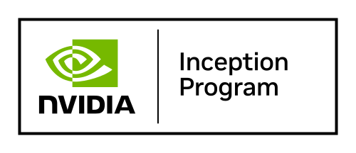

  

  

<h1 align="center">Brrdcast</h1>

  <strong>The Intelligence Layer Between the Internet and the Real World</strong>

---

Search understands the web.  
But the offline world — local businesses, availability, services, real-time ground truth — remains fragmented, unstructured, and invisible to AI.

✨ **Brrdcast is building Hybrid Search.**

A new paradigm that combines:

- 🌐 Web-scale knowledge  
- 📍 Hyperlocal real-world signals  
- 🧠 AI-native retrieval systems  
- 🔐 Privacy-first infrastructure  

> **Our mission: Index the offline world and make it programmable.**

---

## 🧠 What We’re Building

Brrdcast is designed as long-term infrastructure for real-world intelligence.

- ⚡ **Hybrid Retrieval Systems**  
  (Vector + symbolic + geo-contextual search)

- 🗺 **Structured Local Knowledge Graphs**  
  Turning fragmented offline data into machine-readable intelligence

- 📡 **Real-World Signal Ingestion Pipelines**  
  Capturing availability, services, and ground-truth context

- 🔐 **Privacy-First Data Architecture**  
  Built for trust, compliance, and long-term resilience

- 🤖 **AI-Ready APIs**  
  Powering next-generation agents and discovery systems

---

## 🚀 Why It Matters

The next wave of AI won’t just answer questions about the web.  
It will interact with the real world.

AI agents need:
- Structured local context  
- Verifiable availability data  
- Real-world intelligence  
- Reliable hyperlocal grounding  

Search shouldn’t just return links.  
It should understand reality.

Brrdcast is building that layer.

---

## 🏗 Current Focus

- Building the Hybrid Search core  
- Scaling hyperlocal data ingestion  
- Designing agent-native retrieval APIs  
- Creating structured, AI-consumable real-world datasets  

---

## 🌐 Vision

- The offline world is the largest unindexed dataset in existence  
- Hyperlocal intelligence will power the next decade of AI systems  
- Privacy-first infrastructure will outlast extraction-based models  

Brrdcast is not just a product.  
It’s foundational infrastructure for real-world intelligence.
